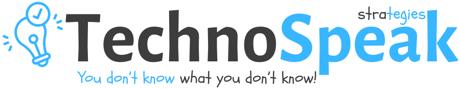

  

    
  

<h2>About Technospeak</h2>

Technospeak is an interactive tech education platform that empowers <strong>users to master digital tools, cybersecurity, and productivity</strong> through simple, engaging tutorials. Designed for students, entrepreneurs, and professionals, we bridge the gap between confusion and confidence in tech.

Our mission is to bridge the digital literacy gap with:

<ul>
  <li><strong>Practical, bite-sized tutorials</strong> that solve real-world problems</li>
  <li><strong>Tiered learning paths</strong> for all skill levels</li>
  <li><strong>Personalized coaching</strong> for accelerated growth</li>
  <li><strong>Enterprise-ready training</strong> solutions</li>
</ul>

<h2>✨ Core Features</h2>

<h3>🎓 Learning Management System</h3>
<table>
  <tr>
    <th>Feature</th>
    <th>Description</th>
  </tr>
  <tr>
    <td>Adaptive Learning</td>
    <td>AI-driven course recommendations</td>
  </tr>
  <tr>
    <td>Progress Tracking</td>
    <td>Visualize your learning journey</td>
  </tr>
  <tr>
    <td>Skill Assessments</td>
    <td>Validate your knowledge</td>
  </tr>
  <tr>
    <td>Certification</td>
    <td>Shareable course completions</td>
  </tr>
</table>

<h3>💼 Subscription Tiers</h3>
<pre><code class="language-php">$user->subscriptions()->create([
    'plan_id' => Plan::DIGITAL_PRODUCTIVITY,
    'price' => 30000, // in cents
    'interval' => 'yearly'
]);</code></pre>

<h2>📊 Dashboard Components</h2>

<h3>🎯 Learning Hub</h3>
<ul>
  <li><strong>Active Courses</strong> - Track current enrollments with progress indicators</li>
  <li><strong>Recommended Content</strong> - AI-powered suggestions</li>
  <li><strong>Achievement Badges</strong> - Earn verifiable credentials</li>
  <li><strong>Learning Calendar</strong> - Schedule study sessions</li>
</ul>

<h3>🗃️ Resource Center</h3>
<ul>
  <li><strong>Cheat Sheets Library</strong>
    <ul>
      <li>Downloadable PDF guides</li>
      <li>Editable templates</li>
      <li>Version-controlled updates</li>
    </ul>
  </li>
  <li><strong>Project Templates</strong>
    <ul>
      <li>Ready-to-use starter kits</li>
      <li>Industry-specific boilerplates</li>
    </ul>
  </li>
  <li><strong>Code Snippets</strong>
    <ul>
      <li>Searchable repository</li>
      <li>Multi-language support</li>
    </ul>
  </li>
</ul>

<h3>⚙️ Admin Panel</h3>
<table>
  <tr>
    <th>Feature</th>
    <th>Description</th>
    <th>Access</th>
  </tr>
  <tr>
    <td>User Management</td>
    <td>CRUD user accounts</td>
    <td>Admin</td>
  </tr>
  <tr>
    <td>Content Moderation</td>
    <td>Approve/reject content</td>
    <td>Moderator+</td>
  </tr>
  <tr>
    <td>Analytics</td>
    <td>Engagement metrics</td>
    <td>Admin</td>
  </tr>
</table>

<h2>🚀 Getting Started</h2>

<h3>Requirements</h3>
<ul>
  <li>PHP 8.2+</li>
  <li>MySQL 8.0+</li>
  <li>Composer 2.2+</li>
  <li>Node.js 18+</li>
</ul>

<h3>Installation</h3>
<pre><code class="language-bash"># Clone repo
git clone https://github.com/kravhuravhu/technospeak.git
cd technospeak

# Install dependencies
composer install
npm install

# Configure
cp .env.example .env
php artisan key:generate

# Migrate
php artisan migrate --seed</code></pre>

<h2>🛠️ Tech Stack</h2>
<ul>
  <li><strong>Backend</strong>: Laravel 10 + NodeJs</li>
  <li><strong>Frontend</strong>: Laravel 10</li>
  <li><strong>Database</strong>: MySQL</li>
  <li><strong>Auth</strong>: Laravel Sanctum</li>
</ul>

<h2>🛠️ Payment Gateway</h2>
<ul>
  <li><strong>Too be added</strong>soon</li>
</ul>

<h2>📜 License</h2>

<i>under</i> Velisa Africa Academy

  
"Empowering digital confidence" 
  📍 Johannesburg, South Africa

